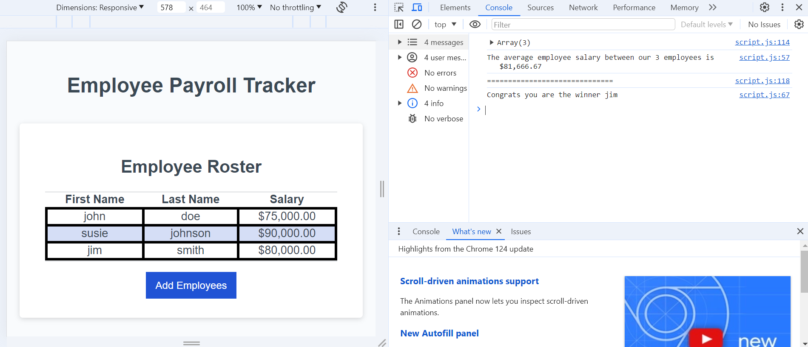

# Employee Payroll Tracker

## Description
The employee payroll tracker is an application that enables a payroll manager to view and manage employee payroll data. This app runs in the browser and features dynamically updated HTML and CSS powered by JavaScript. It has a clean and polished, responsive user interface that adapts to multiple screen sizes.

## Usage
The main user persona of this project is someone in a managerial role that needs to track payroll of their employees. The following Acceptance Criteria are supported: 
- WHEN I click the "Add employee" button
THEN I am presented with a series of prompts asking for first name, last name, and salary
- WHEN I finish adding an employee
THEN I am prompted to continue or cancel
- WHEN I choose to continue
THEN I am prompted to add a new employee
- WHEN I choose to cancel
THEN my employee data is displayed on the page sorted alphabetically by last name, and the console shows computed and aggregated data

The fully functioning application will look like the following: 

## Contributing

Pull requests are welcome. For major changes, please open an issue first
to discuss what you would like to change.

Please make sure to update tests as appropriate.